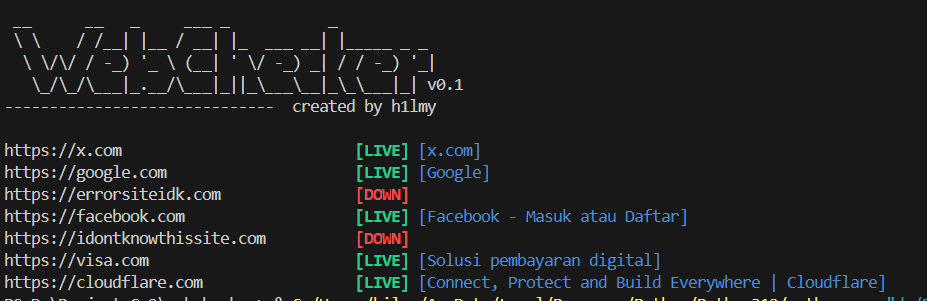

# Webchecker
Buat check web live/down
<h3 align="center">
  
</h3>

```console
usage: app.py [-h] [-d [DOMAIN ...]] [-f [FILE ...]]

Tools untuk melakukan check terhadap website yang sedang aktif/tidak

options:
  -h, --help            show this help message and exit
  -d [DOMAIN ...], --domain [DOMAIN ...]
                        Domain yang akan di-check
  -f [FILE ...], --file [FILE ...]
                        Membaca teks dari file
```

## How To Install

- `pip install requests beautifulsoup` 
- `git clone https://github.com/mxzyy/webchecker.git`
- `python app.py -h`
